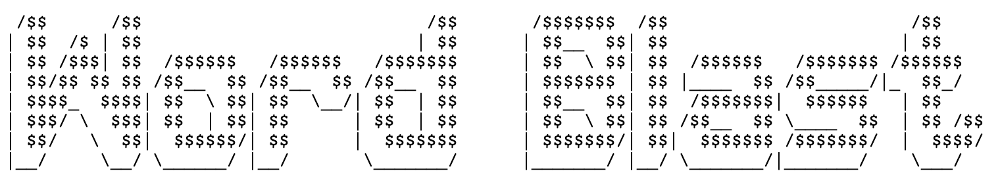
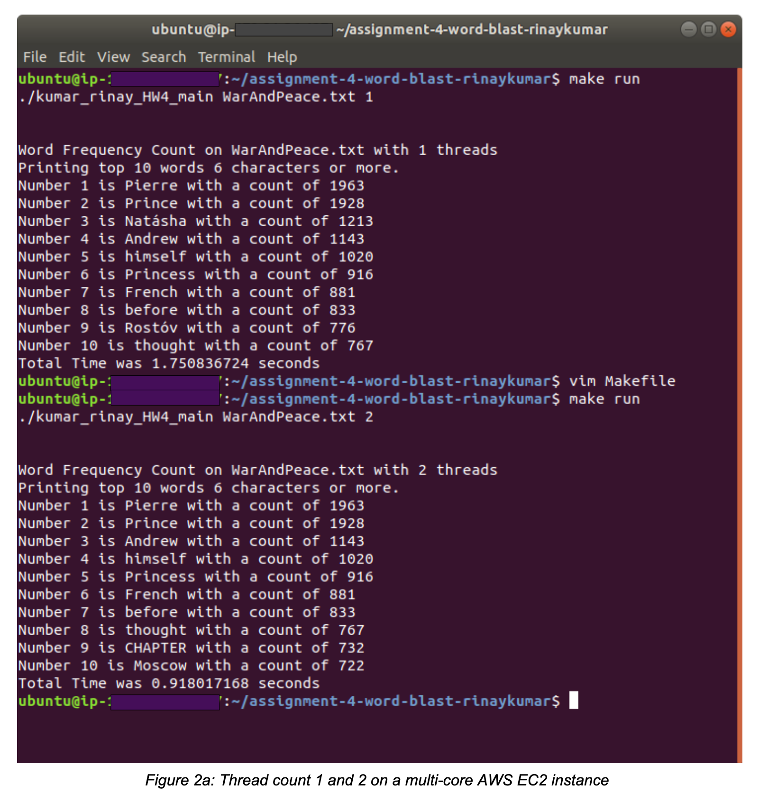
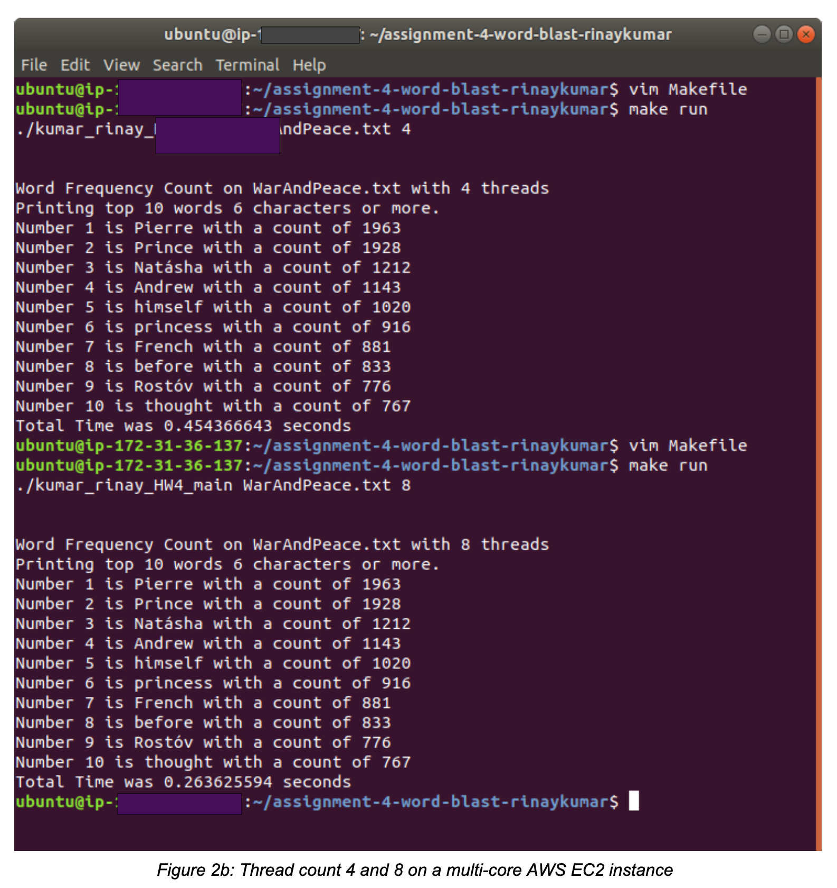

# Word Blast

Word Blast takes a text file, which in this case is the 500,000+ words long entire text of 'War and Peace' by Leo Tolstoy, parses it, finds words with 6 or more characters, counts their occurrences, then displays the top 10 most used 6+ character words in the file, using C pthreads and Linux system calls. 

The file is opened, threads are created, and each thread processes a chunk of the file storing results to a global shared array of structures. Mutex locks are used to protect critical sections.

The runtimes for the program are affected by the number of threads and by the number of cores available. 

Word Blast was run on an Ubunutu AWS EC2 instance with a multi-core setup, where the runtime for 1 thread was 1.7x seconds (Fig. 2a), for 2 threads was 0.9x seconds (Fig. 2a), for 4 threads was 0.4x seconds (Fig. 2b), and for 8 threads was 0.2x seconds (Fig. 2b). The runtimes roughly halved as the number of threads were doubled.

 

 

