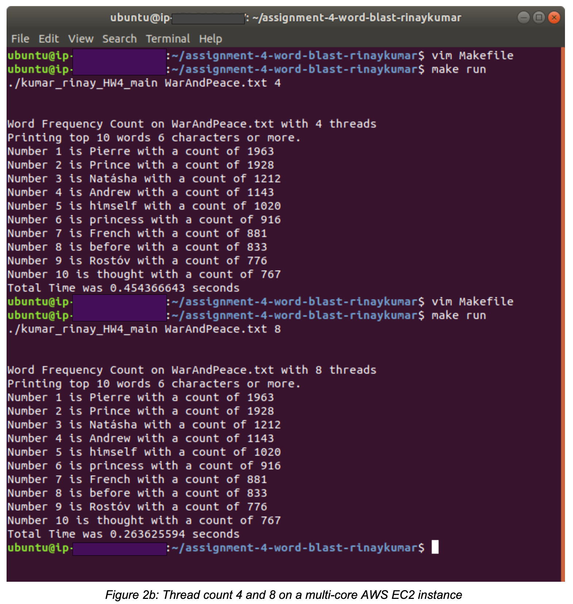

# Word Blast


Word Blast takes a text file, which in this case is the 500,000+ words long entire text of 'War and Peace' by Leo Tolstoy, parses it, finds words with 6 or more characters, counts their occurrences, then displays the top 10 most used 6+ character words in the file and the time it took to process, using C pthreads and Linux system calls. 

The file is opened, threads are created, and each thread processes a chunk of the file storing results to a global shared array of structures. Mutex locks are used to protect critical sections.

The runtimes for the program are affected by the number of threads and by the number of cores available. 

Word Blast was run on an AWS EC2 instance with a multi-core setup, where the runtime for 1 thread was 1.7x seconds (Fig. 2a), for 2 threads was 0.9x seconds (Fig. 2a), for 4 threads was 0.4x seconds (Fig. 2b), and for 8 threads was 0.2x seconds (Fig. 2b). The runtimes roughly half as the number of threads are doubled.

<br/>



### Install

Requires a Linux distro such as Ubuntu and gcc compiler.

```bash
# cd into word-blast folder and make for default 4 threads and WarAndPeace.txt
make run

# specify text file and number of threads in command arguments, ie TextFile and 8 threads
make run ./word_blast_main TextFile.txt 8

# see the word frequency and time the program took to complete
```
